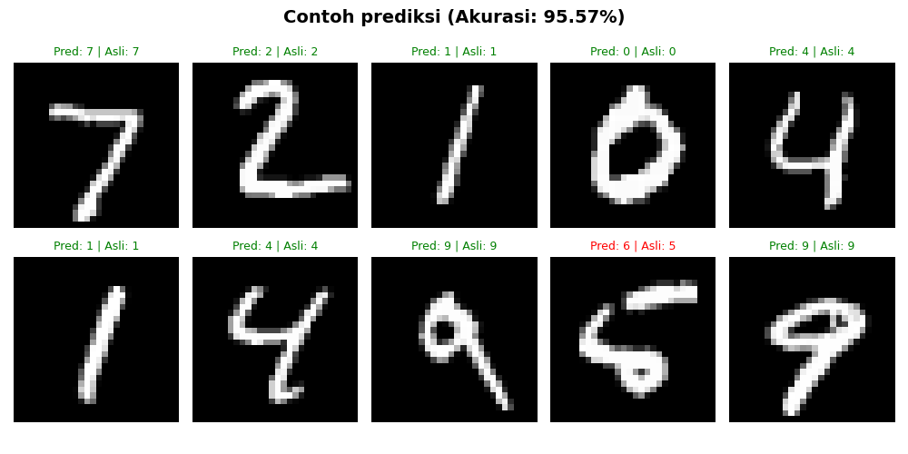

# Neural Network from Scratch

A **Feedforward Neural Network** implemented from scratch using Python and NumPy</br>without any deep learning frameworks like TensorFlow or PyTorch for the training process.

---

## 📁 File Structure

| File | Description |
|------|-------------|
| `network.py` | core neuralnetwork implementation |
| `xor_sample.py` | learning XOR logic |
| `mnist_sample.py` | handwritten digit recognition (MNIST) |
| `neuralnetwork.py` | archive |

---

## ⚙️ How It Works

This neural network uses:
- **Feedforward** - passes input through each layer to produce an output
- **Backpropagation** - computes eror gradients and updates weights
- **Mini-batch Stochastic Gradient Descent (SGD)** - optimization method for training
- **Sigmoid** - activation function applied at each neuron

---

## 🚀 Installation

### Prerequisites
Make sure you have language Python 3.x.x and the following libraries installed:

```bash
pip install -r requirements.txt
```

### Clone the repo
```bash
git clone https://github.com/hanaricode/neuralnetwork-fromscratch.git
cd neuralnetwork-fromscratch
```

---

## 📌 Usage

### 1. XOR Example
Train the network to learn XOR logic:

```bash
python xor_sample.py
```

**sample output:**
```
   Results After Training
================================================
Input         Target      Prediction      Status
------------------------------------------------
[0, 0]          0          0.022727      Correct
[0, 1]          1          0.971336      Correct
[1, 0]          1          0.972169      Correct
[1, 1]          0          0.029067      Correct
```

---

### 2. MNIST Example
Train the network to recognize handwritten digits (0 - 9):

```bash
python mnist_sample.py
```

**Achieved accuracy:** 95.94% on 10,000 test samples

**sample predictions:**



---

## 🏷️ Network Architecture

### XOR
```
Input(2) → Hidden(4) → Output(1)
```

### MNIST
```
Input(784) → Hidden(128) → Hidden(64) → Output(10)
```

---

## 🛠️ Customization

You can easily modify the network architecture:

```python
# Example: 3 hidden layers
net = Network([784, 256, 128, 64, 10])

# Adjust learning rate and epochs
net.train(training_data, epochs=30, mini_batch_size=32, eta=3.0)
```

---

## 📚 References

- [Neural Networks and Deep Learning - Michael Nielsen](http://neuralnetworksanddeeplearning.com/)

---

## 👤 Author

**Hanari** - [@hanaricode](https://github.com/hanaricode)
